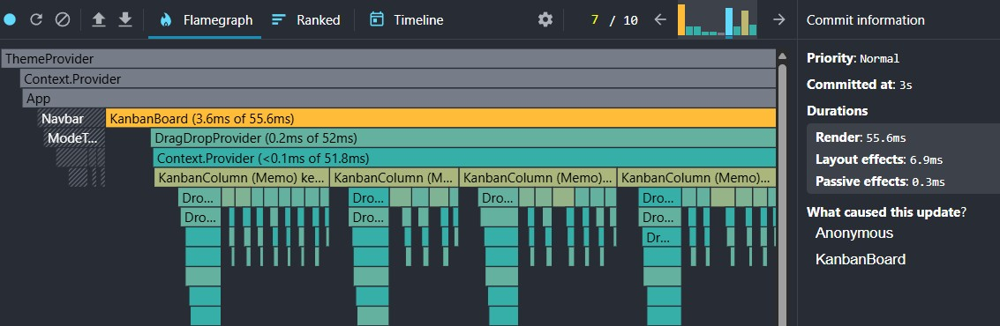
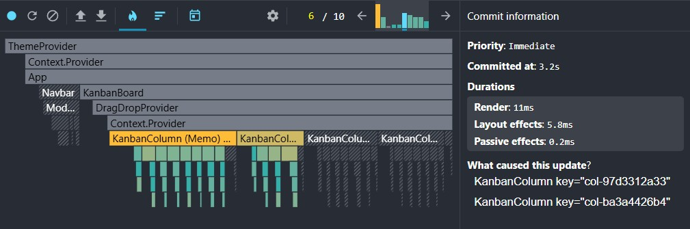

# Kantoo

A simple and intuitive Kanban board for managing your tasks. Organize todos, track progress, and keep your work in sync across sessions with persistent storage.

## Features

- Add, edit, and delete tasks
- Drag and drop columns and tasks for easy organization
- Persistent state across sessions
- Lightweight and fast, optimized for smooth interaction at scale

## Performance

Kantoo went through two major state architecture iterations, each profiled with React DevTools to measure real render time.

### Before: useReducer with prop drilling

State lived at the top level and was passed down through props. Even with `React.memo` on child components, a single card move caused everything to re-render because parent re-renders passed new references down the tree, breaking memoization.



Render time for a single card move: **~55ms**

### After: Zustand with selective subscriptions

Each component subscribes directly to only the slice of state it needs. A card move now re-renders only the affected cards & columns. Nothing else wakes up.



Render time for a single card move: **~15ms**

That is a ~73% reduction in render time.

### Why memoization alone was not enough

`React.memo` prevents re-renders only when props do not change. With `useReducer` at the top, any state update re-rendered the parent and passed new references down, so memo never had a chance to bail out. Zustand's selective subscriptions bypass this entirely & components pull what they need straight from the store.

## Technical Highlights

**Normalized state architecture** stores columns and cards as flat maps keyed by ID rather than deeply nested objects. Updates are scoped to exactly what changed, with no cascading invalidation.

**Zustand with selective subscriptions** replaces the earlier `useReducer` approach. Components subscribe to individual slices of state, so untouched cards and columns never re-render regardless of what else is happening in the board.

**Render optimization** with `React.memo` on `KanbanColumn` and `KanbanCard`, working in combination with Zustand subscriptions rather than fighting against prop drilling.

## Tech Stack

- React + TypeScript
- Zustand for state management with selective subscriptions

## Getting Started

```bash
git clone https://github.com/thexeromin/kantoo.git
pnpm install
pnpm dev
```
